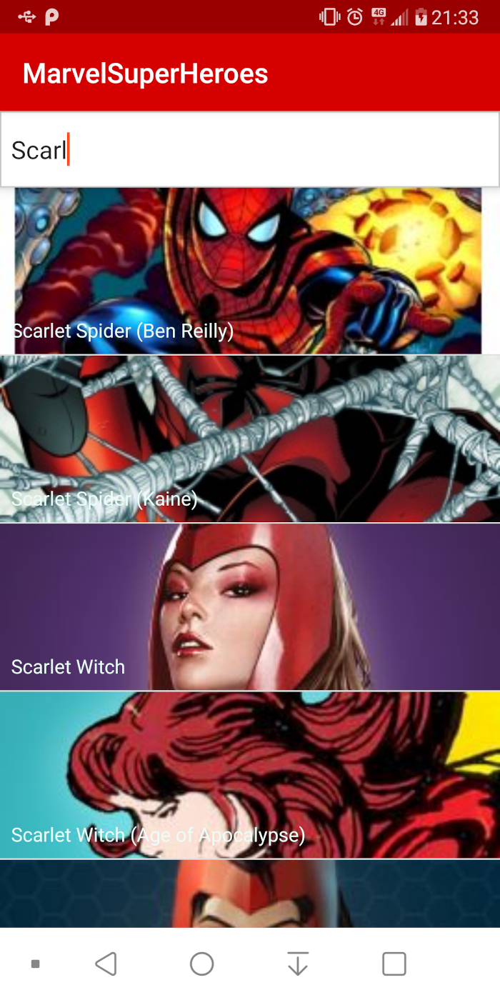
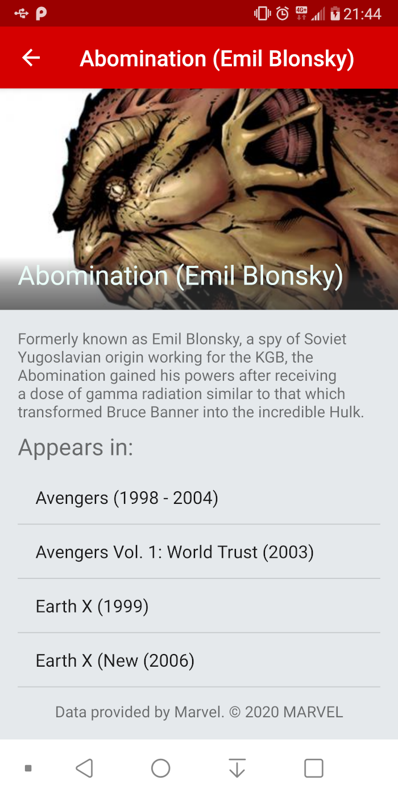

# MarvelSuperHeroes

Sample application that utilizes the [marvelAPI](https://developer.marvel.com/account) to showcase a list of super heroes and a detailed view.

## Important note

In order to launch the application into a device, you must provide a public and a private key from your developer's account and override this fields in gradle.properties:
```sh
MARVEL_PUBLIC_KEY="f580130be5d8dcb319a3b264cb4fdf7e"
MARVEL_PRIVATE_KEY="the real private key is set in ~/.gradle/gradle.properties"
```

# Features

Uses the endpoint

```sh
/v1/public/characters
```
to retrieve a list of characters. Scrolling will append the
```sh
offset
```
parameter to the query using [Markomilos/Paginate](https://github.com/MarkoMilos/Paginate) library.

A search bar at the top helps filtering Heroes:



Clicking on a character will open the detailed view. Showing the name, description and comic series where the hero appears:



# Architecture

The application is divided in two modules:

#### apimodule

Contains the retrofit dependencies and unit tests that check the client.

Data classes were generated using [json2kotlin](https://www.json2kotlin.com/).

#### app

Depends on **apimodule** and contains the rest of the application, using *MVVM* with Clean Architecture and organized in one package for each functionallity.

Repository layer is tested through unit tests and [MockK](https://mockk.io), while *Activities* and *ViewModels* are tested through [Espresso](https://developer.android.com/training/testing/espresso).

### Todos

 - Room integration
 - Screenshot testing
